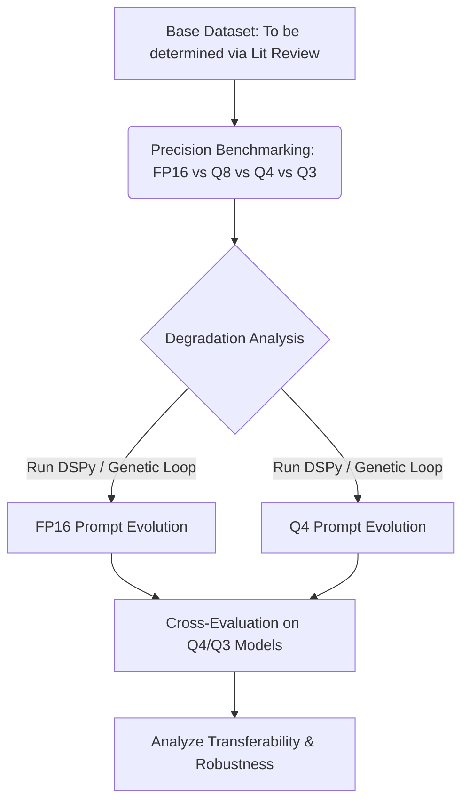

# Research & Project Execution Plan: Quantization-Aware Prompt Evolution (QAPE)

This document serves as the project execution plan and research roadmap for investigating **Quantization-Aware Prompt Evolution (QAPE)**. The objective is to determine if we can optimize prompts specifically for quantized Small Language Models (SLMs) to recover precision-loss and evaluate their transferability across precisions.

---

## 📅 Target Conference & Timeline

* **Selected Target:** **EMNLP 2026 (Short Paper Track)**
* **Submission Deadline:** **August 2, 2026** (~50 days remaining)
* **Format:** 4 pages of content + unlimited pages for references/appendices.
* **Timeline Goal:** Rapid development, benchmarking, optimization, and drafting within a 7-week window.

---

## 🔬 Core Research Questions & Hypotheses

1. **Precision-Induced Degradation ($RQ_1$):** How severely does post-training quantization (FP16 $\to$ Q8 $\to$ Q4 $\to$ Q3) degrade structured reasoning and tool-calling compared to general knowledge retrieval in sub-8B models?
   - *Hypothesis:* Quantization disproportionately degrades reasoning steps (tokens of logic) compared to standard text generation.
2. **Quantization-Aware Evolution ($RQ_2$):** Can an evolutionary prompt search (e.g., genetic prompt mutation) executed directly on a $k$-bit quantized model recover performance to near-FP16 levels?
   - *Hypothesis:* Yes. The optimal prompt space for a quantized model differs from that of a full-precision model due to altered activation paths and attention weights.
3. **Cross-Precision Generalization ($RQ_3$):** If prompt $P_{FP16}$ is evolved on a full-precision model and prompt $P_{Q4}$ is evolved on a 4-bit model, which prompt performs better when evaluating on a 4-bit model?
   - *Hypothesis:* $P_{Q4}$ will outperform $P_{FP16}$ on the 4-bit model (demonstrating the value of "quantization-awareness" during optimization).

---

## 🛠️ Proposed Methodology & Local Stack

### 1. Hardware & Local Inference Stack
* **Local Hardware:** 13-inch Apple M3 MacBook Air (2024), 16 GB Unified Memory.
* **Local Inference constraints:** Due to 16 GB RAM limits, we will evaluate models $\le$ 8B parameters, focusing heavily on sub-4B models (e.g., 2B and 3B parameters) to ensure rapid genetic prompt search iterations without memory bottlenecks.
* **Inference Engine:** `Ollama` or `MLX-LM` for local, fast inference.
* **Models to Evaluate:**
  * `Llama-3.2-3B-Instruct` (FP16, Q8_0, Q4_K_M, Q3_K_L)
  * `Gemma-2-2B-IT` (FP16, Q8_0, Q4_K_M, Q3_K_L)
  * `Phi-3.5-mini-3.8B` (FP16, Q8_0, Q4_K_M)
* **Optimization Framework:** **DSPy** or a custom genetic prompt mutation script.

### 2. Dataset Selections

We have finalized the evaluation benchmarks to target tasks that are highly sensitive to quantization:

1.  **JSON Schema Extraction:** Cleanlab's Structured Output Benchmark (specifically `Cleanlab/pii-extraction` and `Cleanlab/fire-financial-ner-extraction`).
    *   *Purpose:* Evaluate structured compliance and key-value type precision.
2.  **Multi-Step Math Reasoning:** OpenAI's **GSM8K** test dataset.
    *   *Purpose:* Measure calculation drift propagation over multi-hop arithmetic steps.
3.  **Adversarial Math Robustness:** **SVAMP** dataset.
    *   *Purpose:* Evaluate phrasing sensitivity and logical robustness under low-precision constraints.

---

## 📂 Implementation Phases (Accelerated Timeline)

### Phase 1: Literature Review & Setup (June 13 – June 17, Week 1)
*   **Literature Review:** Summarize precision drift and discrete prompt optimization (Completed early).
*   **Environment Setup:** Implement baseline scripts and run test cases (Completed early).
*   **Next step:** Download and parse the benchmark datasets (GSM8K, SVAMP, Cleanlab).

### Phase 2: Experimental Run - Baseline & Degradation (June 17 – June 30, Weeks 1-3)
*   Benchmark `Llama-3.2-3B-Instruct` and `Gemma-2-2B-IT` on FP16, Q8, Q4, and Q3/Q2.
*   Observe and document precision-induced degradation on the hard datasets (JSON structure violations, reasoning drift).

### Phase 3: Prompt Optimization Loop (June 30 – July 14, Weeks 3-5)
*   Run the genetic prompt mutation loops directly on the quantized models to generate $P_{Q4}$.
*   Run cross-precision transfer evaluations (testing $P_{FP16}$ on Q4 models and $P_{Q4}$ on FP16 models).
*   Compile performance recovery metrics.

### Phase 4: Drafting EMNLP Short Paper (July 14 – July 28, Weeks 5-7)
*   Format using EMNLP 2026 LaTeX style guide.
*   Draft the Core Content (Abstract, Introduction, Related Work, Methodology, Experiments, Discussion).
*   Generate charts, results tables, and prompt transfer matrices.

### Phase 5: Polish & Submission (July 28 – August 2, Week 7)
*   Refine drafts and proofread based on peer/advisor feedback.
*   Polish the codebase repository for public replication.
*   Submit to the EMNLP 2026 Short Paper portal before the August 2 deadline.

---

## 🤖 Daily Automation & Git Sync System

To ensure continuous progress, build a strong GitHub contribution graph, and keep the code synced without bloating the main chat thread's memory, we use a **Delegated Subagent Architecture**:

*   **Schedule:** Triggers daily at **12:00 PM (noon)** local time.
*   **Execution Flow:**
    1.  The scheduler wakes up the parent agent in the main thread.
    2.  The parent agent immediately spawns a specialized **`daily-coder` subagent** in a separate conversation context.
    3.  The `daily-coder` subagent scans git status, runs required evaluations, updates `task.md`, and pushes commits to the GitHub repository.
    4.  The subagent logs the day's experimental activities, results, and code modifications by date under the `experimentation_activity_logs/` folder.
    5.  The subagent terminates and passes a short, 2-line execution summary back to the parent agent, keeping the main chat thread's context window extremely clean.

